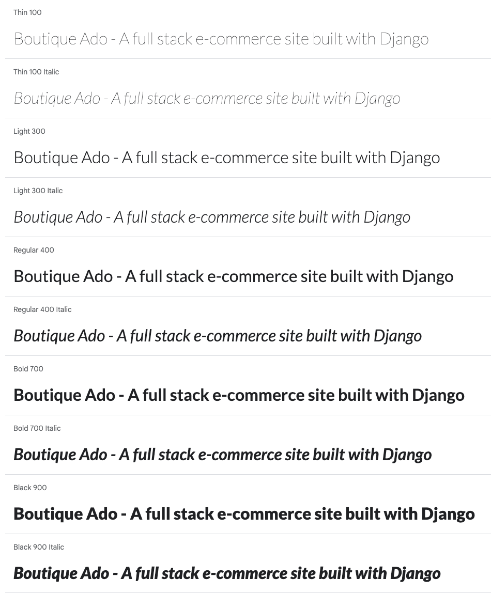

# Boutique Ado


Boutique Ado is a full stack business to customer (B2C) e-commerce site utilising Django, stripe payments and AWS.

Link to deployed site: [Boutique Ado](https://kera-cudmore-boutique-ado.herokuapp.com/)


---

## CONTENTS

* [User Experience](#user-experience)
  * [Project Goals](#project-goals)
  * [User Stories](#user-stories)
* [Design](#design)
  * [Colour Scheme](#colour-scheme)
  * [Typography](#typography)
  * [Imagery](#imagery)
  * [Wireframes](#wireframes)
  * [Database Schema](#database-schema)
  * [Fixtures](#fixtures)
* [Features](#features)
  * [General Features of Each Page](#general-features-of-each-page)
  * [Future Implementations](#future-implementations)
  * [Accessibility](#accessibility)
* [Technologies Used](#technologies-used)
  * [Languages Used](#languages-used)
  * [Databases Used](#databases-used)
  * [Frameworks Used](#frameworks-used)
  * [Libraries & Packages Used](#libraries--packages-used)
  * [Programs Used](#programs-used)
  * [Stripe](#stripe)
* [Deployment & Local Development](#deployment--local-development)
  * [Deployment](#deployment)
  * [Local Development](#local-development)
    * [How to Fork](#how-to-fork)
    * [How to Clone](#how-to-clone)
* [Testing](#testing)
* [Credits](#credits)
  * [Code Used](#code-used)
  * [Content](#content)
  * [Media](#media)

---

## User Experience

### Project Goals

### User Stories

| User Story ID | As a/an | I want to be able to ... | So that I can... |
| :--- | :--- | :--- | :---|
| **VIEWING & NAVIGATION** |
| 1 | Shopper | View a list of products| Select something to purchase |
| 2 | Shopper | View a specific category of products | Quickly find products I'm interested in without having to search through all products. |
| 3 | Shopper | View individual product details | Identify the price, description, product rating, product image and available sizes. |
| 4 | Shopper| Quickly identify deals, clearance items and special offers | Take advantage of special savings on products I'd like to purchase. |
| 5 | Shopper | Easily view the total of my purchases at any time | Avoid spending too much. |
| **REGISTRATION & USER ACCOUNTS** |
| 6 | Site User | Easily register for an account| Have a personal account and be able to view my profile |
| 7 | Site User | Easily log in or out | Access my personal account information |
| 8 | Site User | Easily recover my password in case I forget it | Recover access to my account |
| 9 | Site User | Receive an email confirmation after registering | Verify that my account registration was successful |
| 10 | Site User | Have a personalised user profile | View my personal order history and order confirmations, and save my payment information |
| **SORTING & SEARCHING** |
| 11 | Shopper | Sort the list of available products | Easily identify the best rated, best priced and categorically sort products |
| 12 | Shopper | Sort a specific category of product | Find the best-priced or best-rated product in a specific category, or sort the products in that category by name |
| 13 | Shopper | Sort multiple categories of products simutaneously | Find the best-priced or best-rated products across broad categories, such as clothing or homeware |
| 14 | Shopper | Search for a product by name or description | Find a specific product I'd like to purchase |
| 15 | Shopper | Easily see what I've searched for and the number of results | Quickly decide whether the product I want is available |
| **PURCHASING & CHECKOUT** |
| 16 | Shopper | Easily select the size and quantity of a product when purchasing it | Ensure I don't accidentally select the wrong product, quantity or size |
| 17 | Shopper | View items in my bag to be purchased | Identify the total cost of my purchase and all items I will receive |
| 18 | Shopper | Adjust the quantity of individual items in my bag| Easily make changes to my purchase before checkout |
| 19 | Shopper | Easily eneter my payment information | Check out quickly and with no hassles |
| 20 | Shopper | Feel my personal and payment information is safe and secure | Confidently provide the needed information to make a purchase |
| 21 | Shopper | View an order confirmation after checkout | Verify that I haven't made any mistakes |
| 22 | Shopper | Receive an email confirmation after checking out | Keep the confirmation of what I've purchased for my records |
| **ADMIN & STORE MANAGEMENT** |
| 23 | Store Owner | Add a product| Add new items to my store |
| 24 | Store Owner | Edit/update a product | Change product prices, descriptions, images and other product criteria |
| 25 | Store Owner | Delete a product | Remove items that are no longer for sale |

---

## Design

### Colour Scheme

### Typography

The font Lato has been used throughout the site. This was imported into the CSS file from Google Fonts.



### Imagery

### Wireframes

### Database Schema

### Fixtures

This project utilises fixtures to quickly load a large amount of categories and products into the database via a JSON file. The JSON file contains all the relevent information for each product to be listed on the site. To utilise this method we need to create a fixtures folder in the products folder to store the JSON files. We need to create the categories model first, as the products use the categories as a foreign key. Then create the model for the products. To make use of the image field we've created we will need to install pillow with the command:

```bash
pip3 install pillow
```

We can now run the migrations to create the database tables for the categories and the products, and then add them to the admin.py file in the products app. Finally to install the fixtures using the following command:

```bash
python3 manage.py loaddata categories
python3 manage.py loaddata products
```

---

## Features

### General Features of Each Page

### Future Implementations

### Accessibility

---

## Technologies Used

### Languages Used

HTML, CSS, JavaScript, Python 3

### Databases Used

sqlite3 - for the development database.
ElephantSQL - For the deployed sites database.

### Frameworks Used

[Django](https://www.djangoproject.com/) - Version 3.2.16 - A high-level Python web framework that encourages rapid development and clean, pragmatic design.

[Bootstrap](https://getbootstrap.com/docs/4.6/getting-started/introduction/) - Version 4.6 - A framework for building responsive, mobile-first sites.

### Libraries & Packages Used

[Django Allauth](https://django-allauth.readthedocs.io/en/latest/) - Version 0.41.0 - Used for authentication, registration & account management.

[dj_database_url](https://pypi.org/project/dj-database-url/0.5.0/) - Version 0.5.0 - Allows us to utilise the DATABASE_URL environment variable.

[Stripe](https://pypi.org/project/stripe/) - Version 5.0.0 - To allow us to utilise the Stripe API for payments.

[gunicorn](https://pypi.org/project/gunicorn/) - Version 20.1.0

[psycopg2](https://pypi.org/project/psycopg2/) - Version 2.9.5 - A postgres database adaptor.

[pillow](https://pypi.org/project/Pillow/) - Version 9.3.0 - A python imaging library.
asgiref==3.5.2

[django-countries](https://pypi.org/project/django-countries/7.2.1/) - Version 7.2.1

[django-crispy-forms](https://pypi.org/project/django-crispy-forms/) - Version 1.14.0

oauthlib==3.2.1

pytz==2022.4

requests-oauthlib==1.3.1

sqlparse==0.4.3

### Programs Used

[Balsamiq](https://balsamiq.com/) - Used to create wireframes.

[Shields.io](https://shields.io/) - To add badges to the projects documentation.

[Git](https://git-scm.com/) - For version control.

[GitHub](https://github.com/) - To save and store the files for this project.

[Pip](https://pypi.org/project/pip/) - A tool for installing Python packages.

[Google Dev Tools](https://developer.chrome.com/docs/devtools/) - To troubleshoot, test features and solve issues with responsiveness and styling.

### Stripe

Stripe - setting up stripe elements to accept payment [docs](https://stripe.com/docs/js)

---

## Deployment & Local Development

### Deployment

The project is deployed using Heroku. To deploy the project:

#### **Create the Live Database**

We have been using the sqlite3 database in development, however this is only available for use in development so we will need to create a new external database which can be accessed by Heroku.

1. Go to the [ElephantSQL](https://www.elephantsql.com/) dashboard and click the create new instance button on the top right.
2. Name the plan (your project name is a good choice), select tiny turtle plan (this is the free plan) and choose the region that is closest to you then click the review button.
3. Check the details are all correct and then click create instance in the bottom right.
4. Go to the dashboard and select the database just created.
5. Copy the URL (you can click the clipboard icon to copy)

#### **Heroku app setup**

  1. From the [Heroku dashboard](https://dashboard.heroku.com/), click the new button in the top right corner and select create new app.
  2. Give your app a name (this must be unique), select the region that is closest to you and then click the create app button bottom left.
  3. Open the settings tab and create a new config var of `DATABASE_URL` and paste the database URL you copied from elephantSQL into the value (the value should not have quotation marks around it).

#### **Preparation for deployment in GitPod**

1. Install dj_database_url and psycopg2 (they are both needed for connecting to the external database you've just set up):

   ```bash
   pip3 install dj_database_url==0.5.0 psycopg2
   ```

2. Update your requirements.txt file with the packages just installed:

    ```bash
    pip3 freeze > requirements.txt
    ```

3. In settings.py underneath import os, add `import dj_database_url`

4. Find the section for DATABASES and comment out the code. Add the following code below the commented out database block, and use the URL copied from elephantSQL for the value:

    (NOTE! don't delete the original section, as this is a temporary step whilst we connect the external database. Make sure you don't push this value to GitHub - this value should not be saved to GitHub, it will be added to the Heroku config vars in a later step, this is temporary to allow us to migrate our models to the external database)

    ```python
    DATABASES = {
        'default': dj_database_url.parse('paste-elephantsql-db-url-here')
    }
    ```

5. In the terminal, run the show migrations command to confirm connection to the external database:

    ```bash
    python3 manage.py runserver
    ```

6. If you have connected the database correctly you will see a list of migrations that are unchecked. You can now run migrations to migrate the models to the new database:

    ```bash
    python3 manage.py migrate
    ```

7. Create a superuser for the new database. Input a username, email and password when directed.

    ```bash
    python3 manage.py createsuperuser
    ```

8. You should now be able to go to the browser tab on the left of the page in elephantsql, click the table queries button and see the user you've just created by selecting the auth_user table.
9. We can now add an if/else statement for the databases in settings.py, so we use the development database while in development (the code we commented out) - and the external database on the live site (note the change where the db URL was is now a variable we will use in Heroku):

    ```python
    if 'DATABASE_URL' in os.environ:
        DATABASES = {
          'default': dj_database_url.parse(os.environ.get('DATABASE_URL'))
        }
    else:
        DATABASES = {
            'default': {
                'ENGINE': 'django.db.backends.sqlite3',
                'NAME': os.path.join(BASE_DIR, 'db.sqlite3')
          }
        }
    ```

10. Install gunicorn which will act as our webserver and freeze this to the requirements.txt file:

    ```bash
    pip3 install gunicorn
    pip3 freeze > requirements.txt
    ```

11. Create a `Procfile` in the root directory. This tells Heroku to create a web dyno which runs gunicorn and serves our django app. Add the following to the file (making sure not to leave any blank lines underneath):

    ```Procfile
    web: gunicorn boutique_ado.wsgi:application
    ```

12. Log into the Heroku CLI in the terminal and then run the following command to disable collectstatic. This command tells Heroku not to collect static files when we deploy:

    ```bash
    heroku config:set DISABLE_COLLECTSTATIC=1 --app heroku-app-name-here
    ```

13. We will also need to add the Heroku app and localhost (which will allow GitPod to still work) to ALLOWED_HOSTS = [] in settings.py:

    ```python
    ALLOWED_HOSTS = ['{heroku deployed site URL here}', 'localhost' ]
    ```

14. Save, add, commit and push the changes to GitHub. You can then also initialize the Heroku git remote in the terminal and push to Heroku with:

    ```bash
    heroku git:remote -a {app name here}
    git push heroku master
    ```

15. You should now be able to see the deployed site (without any static files as we haven't set these up yet).

16. To enable automatic deploys on Heroku, go to the deploy tab and click the connect to GitHub button in the deployment method section. Search for the projects repository and then click connect. Click enable automatic deploys at the bottom of the page.

#### **Generate a SECRET KEY & Updating Debug**

1. Django automatically sets a secret key when you create your project, however we shouldn't use this default key in our deployed version, as it leaves our site vulnerable. We can use a random key generator to create a new SECRET_KEY which we can then add to our Heroku config vars which will then keep the key protected.
2. [Django Secret Key Generator](https://miniwebtool.com/django-secret-key-generator/) is an example of a site we could use to create our secret key. Create a new key and copy the value.
3. In Heroku settings create a new config var with a key of `SECRET_KEY`. The value will be the secret key we just created. Click add.
4. In settings.py we can now update the `SECRET_KEY` variable, asking it to get the secret key from the environment, or use an empty string in development:

    ```python
    SECRET_KEY = os.environ.get('SECRET_KEY', ' ')
    ```

5. We can now adjust the `DEBUG` variable to only set DEBUG as true if in development:

    ```python
    DEBUG = 'DEVELOPMENT' in os.environ
    ```

6. Save, add, commit and push these changes.

#### **Set up AWS hosting for static and media files**

! NOTE: These instructions are for setting up AWS hosting as of 5/1/23 - these may change slightly in future versions of AWS.

1. Sign up or login to your [aws amazon account](https://aws.amazon.com) on the top right by using the manage my account button and then navigate to S3 to create a new bucket.
2. The bucket will be used to store our files, so it is a good idea to name this bucket the same as your project. Select the region closest to you. In the object ownership section we need to select ACLs enabled and then select bucket owner preferred. In the block public access section uncheck the block public access box. You will then need to tick the acknowledge button to make the bucket public. Click create bucket.
3. Click the bucket you've just created and then select the properties tab at the top of the page. Find the static web hosting section and choose enable static web hosting, host a static website and enter index.html and error.html for the index and error documents (these won't actually be used.)
4. Open the permissions tab and copy the ARN (amazon resource name). Navigate to the bucket policy section click edit and select policy generator. The policy type will be S3 bucket policy, we want to allow all principles by adding `*` to the input and the actions will be get object. Paste the ARN we copied from the last page into the ARN input and then click add statement. Click generate policy and copy the policy that displays in a new pop up. Paste this policy into the bucket policy editor and make the following changes: Add a `/*` at the end of the resource value. Click save.
5. Next we need to edit the the cross-origin resource sharing (CORS). Paste in the following text:

    ```json
    [
        {
            "AllowedHeaders": [
                "Authorization"
            ],
            "AllowedMethods": [
                "GET"
            ],
            "AllowedOrigins": [
                "*"
            ],
            "ExposeHeaders": []
        }
    ]
    ```

6. Now we need to edit the access control list (ACL) section. Click edit and enable list for everyone(public access) and accept the warning box.

#### **Creating AWS groups, policies and users**

1. Click the services icon on the top right of the page and navigate to IAM - manage access to AWS services. On the left hand navigation menu click user groups and then click the create group button in the top right. This will create the group that our user will be placed in.
2. Choose a name for your group - for example manage-boutique-ado, and click the create policy button on the right. This will open a new page.
3. Click on the JSON tab and then click the link for import managed policy on the top right of the page.
4. Search for S3 and select the one called AmazonS3FullAccess, then click import.
5. We need to make a change to the resources, we need to make resources an array and then change the value for resources. Instead of a `*` which allows all access, we want to paste in our ARN. followed by a comma, and then paste the ARN in again on the next line with `/*` at the end. This allows all actions on our bucket, and all the resources in it.
6. Click the next: tags button and then the next:review .
7. Give the policy a name and description (e.g. boutique-ado-policy | Access to S3 bucket for boutique ado static files.) Click the create policy button.
8. Now we need to atach the policy we just created. On the left hand navigation menu click user groups, select the group and go to the permissions tab. Click the add permissions button on the right and choose attach policies from the dropdown.
9. Select the policy you just created and then click add permissions at the bottom.
10. Now we'll create a user for the group by clicking on the user link in the left hand navigation menu, clicking the add users button on the top right and giving our user a username (e.g. boutique-ado-staticfiles-user). Select programmatic access and then click the next: permissions button.
11. Add the user to the group you just created and then click next:tags button, next:review button and then create user button.
12. You will now need to download the CSV file as this contains the user access key and secret access key that we need to insert into the Heroku config vars. Make sure you download the CSV now as you won't be able to access it again.

#### **Connecting Django to our S3 bucket**

1. Install boto3 and django storages and freeze them to the requirements.txt file.

    ```bash
    pip3 install boto3
    pip3 install django-storages
    pip3 freeze > requirements.txt
    ```

2. Add `storages` to the installed apps in settings.py
3. Add the following code in settings.py to use our bucket if we are using the deployed site:

    ```python
    if 'USE_AWS' in os.environ:
        AWS_S3_OBJECT_PARAMETERS = {
            'Expires': 'Thu, 31 Dec 2099 20:00:00 GMT',
            'CacheControl': 'max-age=9460800',
        }
        
        AWS_STORAGE_BUCKET_NAME = 'enter your bucket name here'
        AWS_S3_REGION_NAME = 'enter the region you selected here'
        AWS_ACCESS_KEY_ID = os.environ.get('AWS_ACCESS_KEY_ID')
        AWS_SECRET_ACCESS_KEY = os.environ.get('AWS_SECRET_ACCESS_KEY')
        AWS_S3_CUSTOM_DOMAIN = f'{AWS_STORAGE_BUCKET_NAME}.s3.amazonaws.com'
    ```

4. In Heroku we can now add these keys to our config vars:

    | KEY | VALUE |
    | :--- | :--- |
    | AWS_ACCESS_KEY_ID | The access key value from the amazon csv file downloaded in the last section |
    | AWS_SECRET_ACCESS_KEY | The secret access key from the amazon csv file downloaded in the last section |
    | USE_AWS | True |

5. Remove the DISABLE_COLLECTSTATIC variable.
6. Create a file called custom_storages.py in the root and import settings and S3Botot3Storage. Create a custom class for static files and one for media files. These will tell the app the location to store static and media files.
7. Add the following to settings.py to let the app know where to store static and media files, and to override the static and media URLs in production.

    ```python
    STATICFILES_STORAGE = 'custom_storages.StaticStorage'
    STATICFILES_LOCATION = 'static'
    DEFAULT_FILE_STORAGE = 'custom_storages.MediaStorage'
    MEDIAFILES_LOCATION = 'media'
    
    STATIC_URL = f'https://{AWS_S3_CUSTOM_DOMAIN}/{STATICFILES_LOCATION}/'
    MEDIA_URL = f'https://{AWS_S3_CUSTOM_DOMAIN}/{MEDIAFILES_LOCATION}/'
    ```

8. Save, add, commit and push these changes to make a deployment to Heroku. In the build log you should be able to see that the static files were collected, and if we check our S3 bucket we can see the static folder which has all the static files in it.
9. Navigate to S3 and open your bucket. We now want to create a new file to hold all the media files for our site. We can do this by clicking the create folder button on the top right and naming the folder media.

#### **Setting up Stripe**

1. We now need to add our Stripe keys to our config vars in Heroku to keep these out of our code and keep them private. Log into Stripe, click developers and then API keys.
2. Create 2 new variables in Heroku's config vars - for the publishable key (STRIPE_PUBLIC_KEY) and the secret key (STRIPE_SECRET_KEY) and paste the values in from the Stripe page.
3. Now we need to add the WebHook endpoint for the deployed site. Navigate to the WebHooks link in the left hand menu and click add endpoint button.
4. Add the URL for our deployed sites WebHook, give it a description and then click the add events button and select all events. Click Create endpoint.
5. Now we can add the WebHook signing secret to our Heroku config variables as STRIPE_WH_SECRET.
6. In settings.py:

    ```python
    STRIPE_PUBLIC_KEY = os.getenv('STRIPE_PUBLIC_KEY', '')
    STRIPE_SECRET_KEY = os.getenv('STRIPE_SECRET_KEY', '')
    STRIPE_WH_SECRET = os.getenv('STRIPE_WH_SECRET', '')
    ```

### Local Development

#### How to Fork

To fork the repository:

1. Log in (or sign up) to GitHub.

2. Go to the repository for this project, [Boutique Ado](https://github.com/kera-cudmore/Boutique-Ado).

3. Click on the fork button in the top right of the page.

#### How to Clone

To clone the repository:

1. Log in (or sign up) to GitHub.

2. Go to the repository for the project.

3. Click the Code button, select whether you would like to clone with HTTPS, SSH or the GitHub CLI and copy the link given.

4. Open the terminal in your chosen IDE and change the current working directory to the location you would like to use for the cloned repository.

5. Type the following command into the terminal `git clone` followed by the link you copied in step 3.

6. Set up a virtual environment (this step is not required if you are using the Code Institute template and have opened the repository in GitPod as this will have been set up for you).

7. Install the packages from the requirements.txt file by running the following command in the terminal:

```bash
pip3 install -r requirements.txt
```

---

## Testing

Please refer to the [TESTING.md](TESTING.md) file for all testing performed.

---

## Credits

### Code Used

This project was created as part of a series of lessons with the Code Institute as part of their Level 5 Diploma in Web Application Development.

### Content

The content required for the site was provided as part of the lesson materials by the Code Institute.

### Media

A link to download the product images was provided by the Code Institute, who sourced the material from [kaggle](https://www.kaggle.com/).
