# Boutique Ado - Testing

Visit the deployed site here: [Boutique Ado](https://kera-cudmore-boutique-ado.herokuapp.com/)

---

## Automated Testing

### HTML Validation

[W3C validator](https://validator.w3.org/) was used to validate the HTML in this project.

| Page | Result |
| :--- | :--- |
| Home | [Pass](https://validator.w3.org/nu/?showsource=yes&doc=https%3A%2F%2Fkera-cudmore-boutique-ado.herokuapp.com%2F) |
| Products page | [Pass](https://validator.w3.org/nu/?showsource=yes&doc=https%3A%2F%2Fkera-cudmore-boutique-ado.herokuapp.com%2Fproducts%2F) |
| Products details | [Pass](https://validator.w3.org/nu/?showsource=yes&doc=https%3A%2F%2Fkera-cudmore-boutique-ado.herokuapp.com%2Fproducts%2F2%2F) |
| Add product | [Pass](https://validator.w3.org/nu/?showsource=yes&doc=https%3A%2F%2Fkera-cudmore-boutique-ado.herokuapp.com%2Fproducts%2Fadd%2F) |
| Edit product | [Pass](https://validator.w3.org/nu/?showsource=yes&doc=https%3A%2F%2Fkera-cudmore-boutique-ado.herokuapp.com%2Fproducts%2Fedit%2F8%2F) |
| Bag | [Pass](https://validator.w3.org/nu/?showsource=yes&doc=https%3A%2F%2Fkera-cudmore-boutique-ado.herokuapp.com%2Fbag%2F) |
| Checkout | [Pass](https://validator.w3.org/nu/?showsource=yes&doc=https%3A%2F%2Fkera-cudmore-boutique-ado.herokuapp.com%2Fcheckout%2F) |
| Profile | [Pass](https://validator.w3.org/nu/?showsource=yes&doc=https%3A%2F%2Fkera-cudmore-boutique-ado.herokuapp.com%2Fprofile%2F) |

### CSS Validation

[W3C validator](https://validator.w3.org/) was used to validate the CSS in this project.

| File | Result |
| :--- | :--- |
| static/css/base.css | Pass |
| checkout/static/css/checkout.css | Pass |

### JavaScript Validation

[JS Hint](https://jshint.com/) was used to validate the projects JavaScript files.

| File | Result |
| :--- | :--- |
| checkout/static/js/stripe_elements.js | Pass (Mentions one unused variable - stripe) |

### Python Validation

PEP8 style guideline compliance was checked using [pycodestyle](https://pycodestyle.pycqa.org/en/latest/index.html) in the IDE while developing the project and [CI Python Linter](https://pep8ci.herokuapp.com/) was also used to check all python files were free of errors.

| File | Result |
| :--- | :--- |
| boutique_ado/settings.py | Pass |
| boutique_ado/urls.py | Pass |
| bag/contexts.py | Pass |
| bag/urls.py | Pass |
| bag/views.py | Pass |
| checkout/admin.py | Pass |
| checkout/forms.py | Pass |
| checkout/models.py | |
| checkout/signals.py | Pass |
| checkout/urls.py | Pass |
| checkout/views.py | Pass |
| checkout/webhook_handler.py | Pass |
| checkout/webhooks.py | Pass |
| home/urls.py | Pass |
| home/views.py | Pass |
| products/admin.py | Pass |
| products/forms.py | Pass |
| products/models.py | Pass |
| products/urls.py | Pass |
| products/views.py | Pass |
| products/widgets.py | Pass |
| profiles/forms.py | Pass |
| profiles/models.py | Pass |
| profiles/urls.py | Pass |
| profiles/views.py | Pass |

### Lighthouse Testing

[Google Lighthouse](https://developer.chrome.com/docs/lighthouse/overview/) testing was performed on the site to check for performance, accessibility, best practices and SEO.

#### Desktop

#### Mobile

### WAVE Accessibility Testing

[WAVE](https://wave.webaim.org/) (web accessibility evaluation tool) was used on the site to check for issues relating to accessibility.

---

## Manual Testing

### User Stories Testing

| No | Goal |  How are they Achieved? | Evidence |
| :--- | :--- | :--- | :--- |
| 1 | Shopper - View a list of products so I can select something to purchase | A navbar is provided at the top of the page which allows users easy access to their account, shopping bag, search bar and the product categories. |  |
| 2 | Shopper - View a specific category of products so I can quickly find products I'm interested in without having to search through all products. | When a user clicks on a category, they are then provided a dropdown with a breakdown of items within the chosen category. If a user choses the view all link, the page will display all items but the user will also be given the choice to refine the products shown via links to the sub-categories at the top of the page. |  |
| 3 | Shopper - View individual product details to identify the price, description, product rating, product image and available sizes. | When the user selects a product, they will be taken to the product detail page which lists more information about the item, such as the item name, price and description. A tag will display showing what category the product belongs to. If a rating is available for the product, this will also be displayed. | 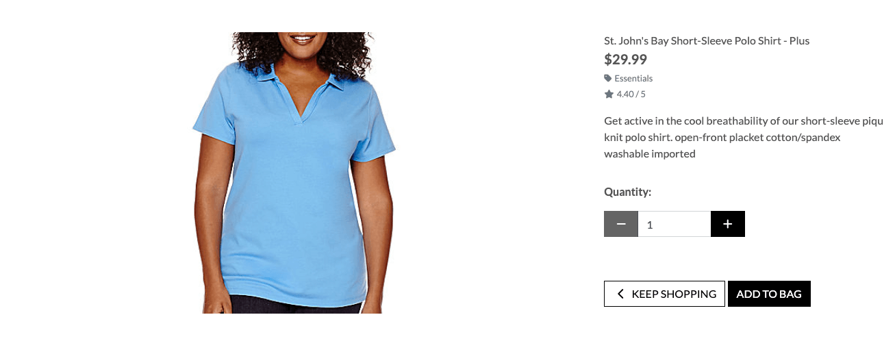 |
| 4 | Shopper - Quickly identify deals, clearance items and special offers to take advantage of special savings on products I'd like to purchase. | There is a category choice for users called special offers which allows users to view deals or clearance items. |  |
| 5 | Shopper - Easily view the total of my purchases at any time to avoid spending too much. | Users are able to view all items selected for purchase from their bag. Their bag will list each item selected for purchase, along with the quantity, item price and subtotal for that item. At the bottom of their bag will be a section that lets them know the total for the items in their bag, the delivery charge (if applicable) and their grand total | 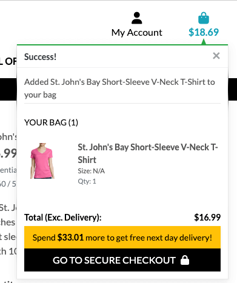 |
| **REGISTRATION & USER ACCOUNTS** |
| 6 | Site User - Easily register for an account to have a personal account and be able to view my profile |  Users can register for an account via the account icon in the navbar, which is available on all pages of the site. If a user doesn't have an account during checkout, they are given an option to create an account on the checkout page. | |
| 7 | Site User - Easily log in or out so I can access my personal account information | Users are able to log in and out of their account through the account icon on the navbar which is accessible on all pages of the site. | 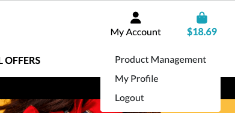 |
| 8 | Site User - Easily recover my password in case I forget it so I can recover access to my account | If a user has forgotten their password, they can click on the forgotten password button during login to reset their password. |  |
| 9 | Site User - Receive an email confirmation after registering to verify that my account registration was successful | Users receive an email asking them to click the link in the email to verify their email address and complete the registration process. | |
| 10 | Site User - Have a personalised user profile to view my personal order history and order confirmations, and save my payment information | Users can view their orders in their profile | 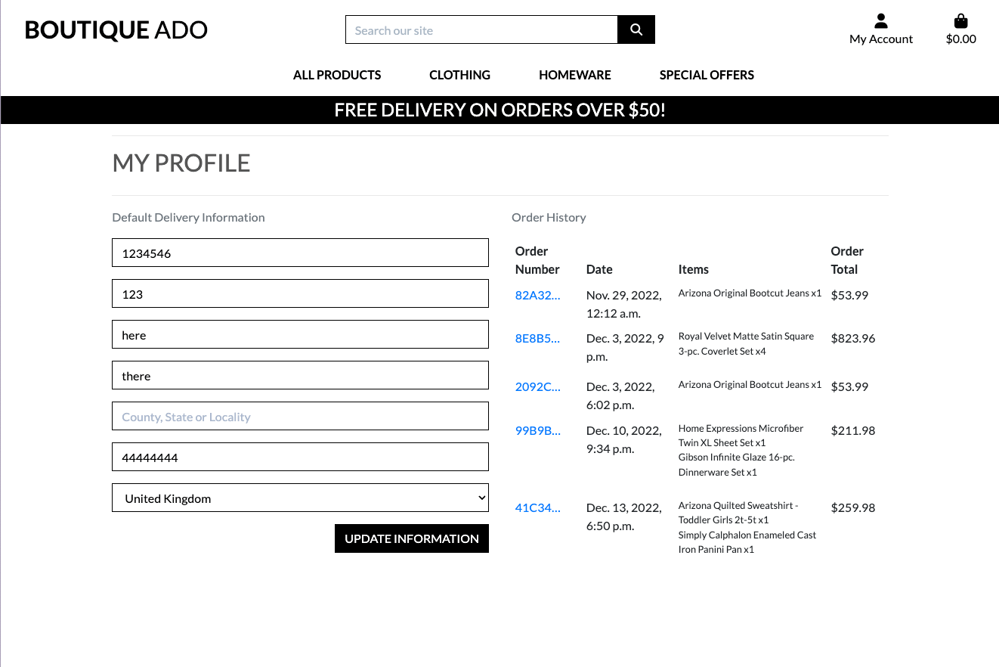 |
| **SORTING & SEARCHING** |
| 11 | Shopper - Sort the list of available products to easily identify the best rated, best priced and categorically sort products | Users may view products bases on their price, rating or category from the navbar by selecting all products and then the option they want from the dropdown |  |
| 12 | Shopper - Sort a specific category of product to find the best-priced or best-rated product in a specific category, or sort the products in that category by name | Users are given chance to sort products on the products pages via a sort dropdown in the top right. This allows users to sort products by their name, price, rating and category - ascending or descending | 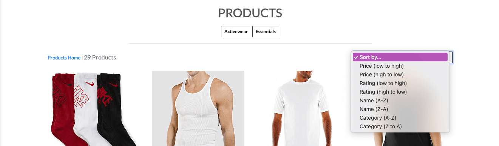 |
| 13 | Shopper - Sort multiple categories of products simutaneously to find the best-priced or best-rated products across broad categories, such as clothing or homeware | Users may select the all products link on the navbar and then choose how they wish to sort | 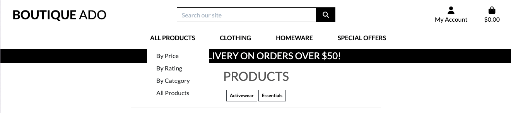 |
| 14 | Shopper - Search for a product by name or description to find a specific product I'd like to purchase | Users are provided with a search bar in the navbar which allows them to search for items. The search not only checks the product name, but also their description for the search term used. |  |
| 15 | Shopper - Easily see what I've searched for and the number of results to quickly decide whether the product I want is available | Users are given feedback on their search term and the number of products which match the search term on the results page in the top left. | 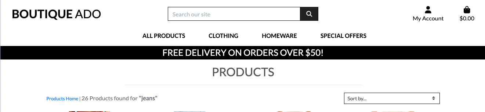|
| **PURCHASING & CHECKOUT** |
| 16 | Shopper - Easily select the size and quantity of a product when purchasing it to ensure I don't accidentally select the wrong product, quantity or size | Users are provided a quantity input box on the product detail page which allows them to increase or decrease the quantity required using the plus or minus buttons. Users may also type the value they wish to purchase directly into the quantity box. Once a user adds a product to their bag they receive a toast notification of the product they've added together with the quantity and size if applicable | 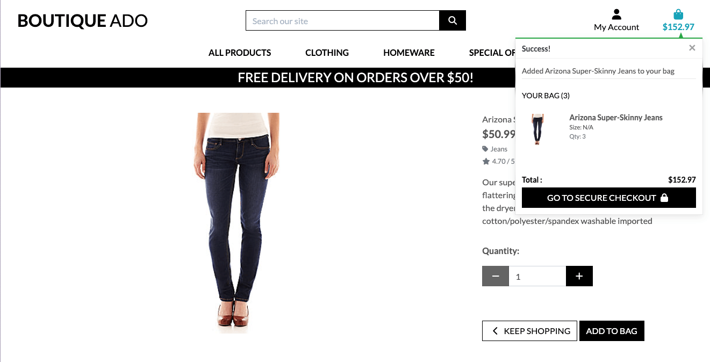|
| 17 | Shopper - View items in my bag to be purchased to identify the total cost of my purchase and all items I will receive | When the user views their bag, they will be presented with a list of all items selected for purchase, information shown will include an image of the item, the items name, the quantity of the item selected, the unit price of the item and the subtotal price for that item. At the bottom of the bag the user will be given the subtotal for all the items they are purchasing, the delivery fee (if applicable) and the grand total of their order. | 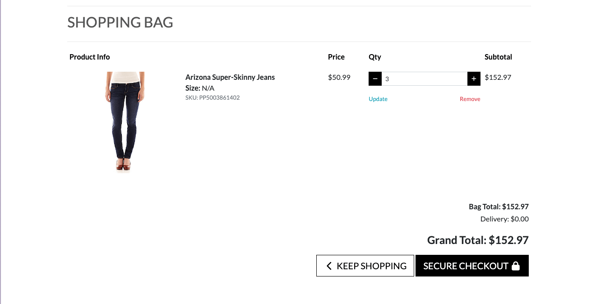 |
| 18 | Shopper - Adjust the quantity of individual items in my bag to easily make changes to my purchase before checkout | The users are given a quantity selector in the bag that looks the same as on the product detail page to provide continuity and familiarity for the user. Once the user has selected the new quantity of the item, they click the update link under the quantity input and the page will reload with the new quantities. If a user decides they would like to remove the item completely from their bag they can remove the item by clicking the remove link under the product. This removes the product and shows a toast which confirms that the user has successfully deleted the selected item from their bag. | 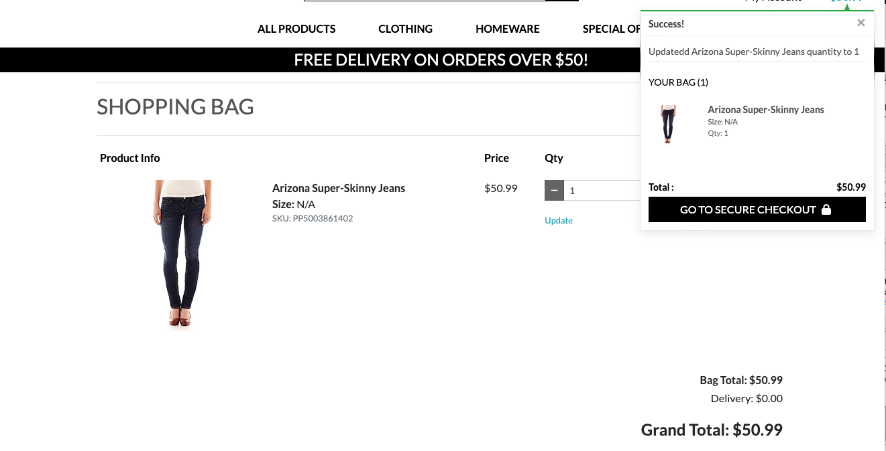 |
| 19 | Shopper - Easily eneter my payment information to check out quickly and with no hassles | When a user is taken to the checkout page they can clearly see 3 sections of information that need to be completed to complete their order - their details, the delivery information and the payment information. Feedback is provided to the user whilst completing the checkout if any information they give is invalid. | 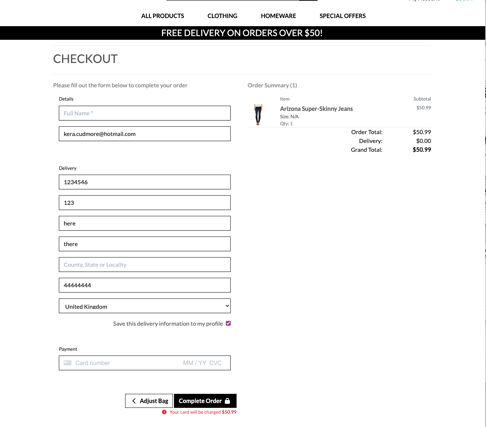 |
| 20 | Shopper - Feel my personal and payment information is safe and secure so I can confidently provide the needed information to make a purchase | Boutique Ado provides its checkout facilities through Stripe | [Stripe Security](https://stripe.com/docs/security?locale=en-GB) |
| 21 | Shopper - View an order confirmation after checkout to verify that I haven't made any mistakes | Users are taking to an order confirmation page once they have successfully checked out which provides them with their order information, such as their order details and the order date. They are also shown their order details which lists the items they have purchased along with their quantity and the price of the item. A delivery section provides them with information on where they are having their order delivered to and finally they are shown the billing information section which provides them with their total, the delivery fee (if applicable) and the grand total for their order. | 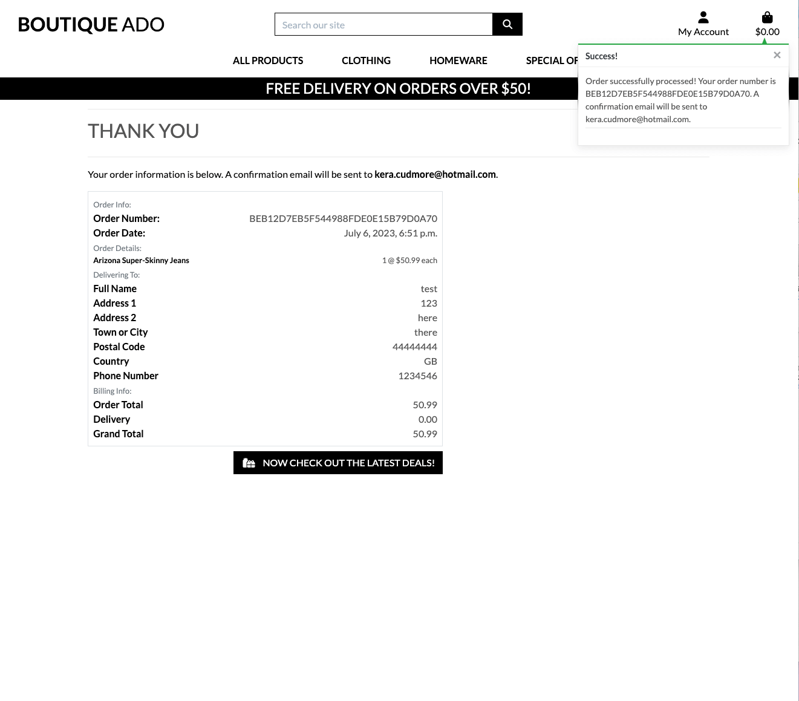 |
| 22 | Shopper - Receive an email confirmation after checking out to keep the confirmation of what I've purchased for my records | Upon successful checkout, a user will be sent a confirmation email to the email address provided at checkout to confirm their order | |
| **ADMIN & STORE MANAGEMENT** |
| 23 | Store Owner - Add new items to my store | Admin are able to add new products to the store directly from the store website when logged in as a superuser. This option is provided to them under the account icon in the navbar - product management. If an admin clicks on this link, they will be taken to the add product page where they can add a new item to be added to the store. | |
| 24 | Store Owner - Edit/update a product to change product prices, descriptions, images and other product criteria | When a superuser is logged in, they are shown an edit button underneath each product on the products page, and are also shown an edit button when viewing a product. Once clicked they will be taken to a page similar in layout to the add product page (to provide continuity and familiarity) and are able to edit the products information. | 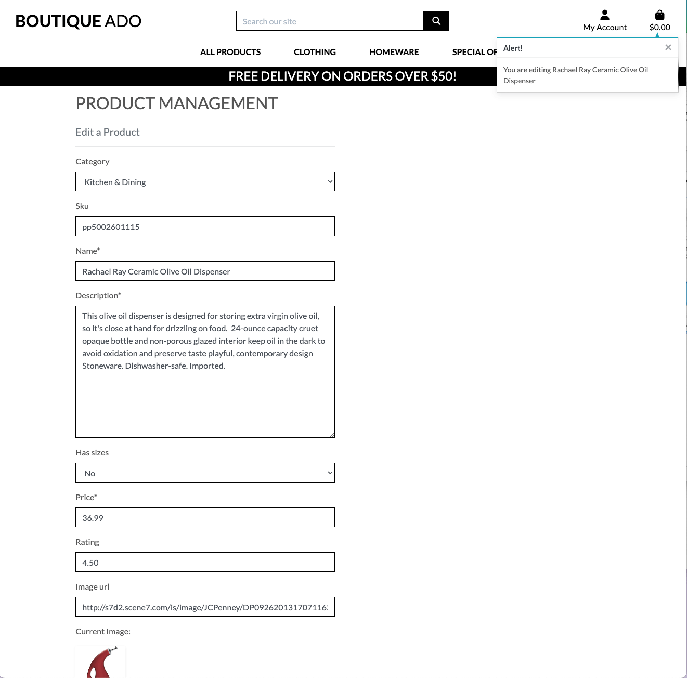 |
| 25 | Store Owner - Delete products that are no longer for sale | When a superuser is logged in, they are shown a delete button underneath each product on the products page, and are also shown a delete button when viewing a product. |  |

### Full Testing

| Feature | Expected Outcome | Testing Performed | Result | Pass or Fail |
| :--- | :--- | :--- | :--- | :--- |

---

## Bugs

### Solved Bugs

| Bug No. | Bug | How I Solved | Evidence |
| :--- |:--- |:--- | :---: |
||||

### Known Bugs

| Bug No. | Bug | Evidence |
| :--- | :--- | :--- |
||||
