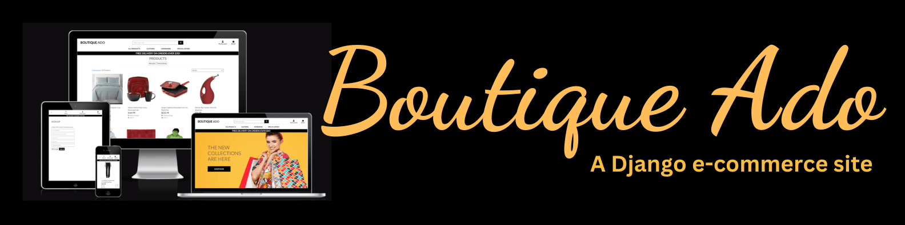

# Boutique Ado - Testing

Visit the deployed site here: [Boutique Ado](https://kera-cudmore-boutique-ado.herokuapp.com/)

---

## CONTENTS

* [Automated Testing](#automated-testing)
  * [HTML Validation](#html-validation)
  * [CSS Validation](#css-validation)
  * [JavaScript Validation](#javascript-validation)
  * [Python Validation](#python-validation)
  * [Lighthouse Testing](#lighthouse-testing)
    * [Desktop](#desktop)
    * [Mobile](#mobile)
  * [WAVE Accessibility Testing](#wave-accessibility-testing)
* [Manual Testing](#manual-testing)
  * [User Stories Testing](#user-stories-testing)
  * [Full Testing](#full-testing)
* [Bugs](#bugs)
  * [Solved Bugs](#solved-bugs)
  * [Known Bugs](#known-bugs)

---

## Automated Testing

### HTML Validation

[W3C validator](https://validator.w3.org/) was used to validate the HTML in this project.

| Page | Result |
| :--- | :--- |
| home | |
| products page | |
| products details | |
| add product | |
| edit product | |
| bag | |
| checkout | |
| profile | |

### CSS Validation

[W3C validator](https://validator.w3.org/) was used to validate the CSS in this project.

| File | Result |
| :--- | :--- |
| static/css/base.css | Pass |
| checkout/static/css/checkout.css | Pass |

### JavaScript Validation

[JS Hint](https://jshint.com/) was used to validate the projects JavaScript files.

| File | Result |
| :--- | :--- |
| checkout/static/js/stripe_elements.js | Pass (Mentions one unused variable - stripe) |

### Python Validation

PEP8 style guideline compliance was checked using [pycodestyle](https://pycodestyle.pycqa.org/en/latest/index.html) in the IDE while developing the project and [CI Python Linter](https://pep8ci.herokuapp.com/) was also used to check all python files were free of errors.

| File | Result |
| :--- | :--- |
| boutique_ado/settings.py | Pass |
| boutique_ado/urls.py | Pass |
| bag/contexts.py | Pass |
| bag/urls.py | Pass |
| bag/views.py | Pass |
| checkout/admin.py | Pass |
| checkout/forms.py | Pass |
| checkout/models.py | |
| checkout/signals.py | Pass |
| checkout/urls.py | Pass |
| checkout/views.py | Pass |
| checkout/webhook_handler.py | Pass |
| checkout/webhooks.py | Pass |
| home/urls.py | Pass |
| home/views.py | Pass |
| products/admin.py | Pass |
| products/forms.py | Pass |
| products/models.py | Pass |
| products/urls.py | Pass |
| products/views.py | Pass |
| products/widgets.py | Pass |
| profiles/forms.py | Pass |
| profiles/models.py | Pass |
| profiles/urls.py | Pass |
| profiles/views.py | Pass |

### Lighthouse Testing

[Google Lighthouse](https://developer.chrome.com/docs/lighthouse/overview/) testing was performed on the site to check for performance, accessibility, best practices and SEO.

#### Desktop

#### Mobile

### WAVE Accessibility Testing

[WAVE](https://wave.webaim.org/) (web accessibility evaluation tool) was used on the site to check for issues relating to accessibility.

---

## Manual Testing

### User Stories Testing

| No | Goal |  How are they Achieved? | Evidence |
| :--- | :--- | :--- | :--- |
| 1 | Shopper - View a list of products so I can select something to purchase | | |
| 2 | Shopper - View a specific category of products so I can quickly find products I'm interested in without having to search through all products. | | |
| 3 | Shopper - View individual product details to identify the price, description, product rating, product image and available sizes. | | |
| 4 | Shopper - Quickly identify deals, clearance items and special offers to take advantage of special savings on products I'd like to purchase. | | |
| 5 | Shopper - Easily view the total of my purchases at any time to avoid spending too much. | | |
| **REGISTRATION & USER ACCOUNTS** |
| 6 | Site User - Easily register for an account to have a personal account and be able to view my profile | | |
| 7 | Site User - Easily log in or out so I can access my personal account information | | |
| 8 | Site User - Easily recover my password in case I forget it so I can recover access to my account | | |
| 9 | Site User - Receive an email confirmation after registering to verify that my account registration was successful | | |
| 10 | Site User - Have a personalised user profile to view my personal order history and order confirmations, and save my payment information | | |
| **SORTING & SEARCHING** |
| 11 | Shopper - Sort the list of available products to easily identify the best rated, best priced and categorically sort products | | |
| 12 | Shopper - Sort a specific category of product to find the best-priced or best-rated product in a specific category, or sort the products in that category by name | | |
| 13 | Shopper - Sort multiple categories of products simutaneously to find the best-priced or best-rated products across broad categories, such as clothing or homeware | | |
| 14 | Shopper - Search for a product by name or description to find a specific product I'd like to purchase | | |
| 15 | Shopper - Easily see what I've searched for and the number of results to quickly decide whether the product I want is available | | |
| **PURCHASING & CHECKOUT** |
| 16 | Shopper - Easily select the size and quantity of a product when purchasing it to ensure I don't accidentally select the wrong product, quantity or size | | |
| 17 | Shopper - View items in my bag to be purchased to identify the total cost of my purchase and all items I will receive | | |
| 18 | Shopper - Adjust the quantity of individual items in my bag to easily make changes to my purchase before checkout | | |
| 19 | Shopper - Easily eneter my payment information to check out quickly and with no hassles | | |
| 20 | Shopper - Feel my personal and payment information is safe and secure so I can confidently provide the needed information to make a purchase | | |
| 21 | Shopper - View an order confirmation after checkout to verify that I haven't made any mistakes | | |
| 22 | Shopper - Receive an email confirmation after checking out to keep the confirmation of what I've purchased for my records | | |
| **ADMIN & STORE MANAGEMENT** |
| 23 | Store Owner - Add new items to my store | | |
| 24 | Store Owner - Edit/update a product to change product prices, descriptions, images and other product criteria | | |
| 25 | Store Owner - Delete products that are no longer for sale | | |

### Full Testing

| Feature | Expected Outcome | Testing Performed | Result | Pass or Fail |
| :--- | :--- | :--- | :--- | :--- |

---

## Bugs

### Solved Bugs

| Bug No. | Bug | How I Solved | Evidence |
| :--- |:--- |:--- | :---: |
||||

### Known Bugs

| Bug No. | Bug | Evidence |
| :--- | :--- | :--- |
||||
